# 0.Introduction
目标：从cuda底层学习深度学习框架如何构建，并最终自己构建一个深度学习框架。  
# 1.Parallel Programming
## 1.1 why GPU&parallel programming
背景：在现代，越来越多的任务需要处理大规模的数据并且需要提高计算效率。为了解决这个问题，人们有两种思路：一种是提升计算频率，在一定时间内执行的计算次数增加；一种是讲任务分割进行并行编程，分别处理。  
对于第一种方法我们发现，由于能源消耗过大和难以散热的限制，计算的Clock Frequency（主频，计算效率）遇到了瓶颈，难以大幅增长  
相反，对于方法二，随着工艺的提升，计算单元的面积在逐渐缩小，芯片上面可以容纳的晶体管数量在增加，这些晶体管可以并行地处理任务，从而使得并行计算能力有充足发展空间。于是，我们需要重视并行计算这种加速模式。  
CPU和GPU虽然都具备并行计算的能力（CPU的多核），但是两者还是各有侧重：  
* CPU的电路更加复杂，在单任务的计算上灵活性和性能远超GPU，但是显然的，在能源消耗上也非常大，并行计算能力远弱于GPU  
* GPU有着更加丰富的并行计算电路，能效比（Power Efficiency）高，用更少的电量完成更多的工作，但是在处理问题上不如cpu灵活，并且GPU的编程模式更加受限，只在处理特定的任务时才有优势。  

* CPU追求延迟（latency）优化：The time required for each task
*  GPU追求吞吐量（throughout）提升：The total tasks per time unit  
## 1.2 Cuda programming
一个典型的Cuda程序分成两部分：CPU部分和GPU部分  
CPU被称为Host，GPU被称为Device。从名字上也可以看出，整体的运转主要由CPU统揽全局。  

CPU 的工作 是管理 GPU 内存和启动内核（Kernel） 。具体步骤包括：

* 在 GPU 上分配内存 。
* 将数据从 CPU 复制到 GPU 。
* 启动 GPU 内核 。
* 将结果从 GPU 复制回 CPU 。  

GPU 的工作 
* 是并行运行大量的内核 。
什么是内核？什么是线程(thread)？  
  
如图：  
线程是GPU上的一个最小运算单元（图中的波浪线），多个线程构成了一个线程块（block），多个线程块构成一个网格（grid）。这是线程的组织形式  
而一个内核（Kernel）对于一个线程(thread)来说，就像一个 C 程序，每个线程都并行地执行这个kernel程序。  
例如：
```cpp
kernel_function<<< gridDim:number of blocks, blockDim:number of threads per block >>>(args);
```
这就是在调用一个kernel函数，其中gridDim和blockDim分别表示网格和线程块的大小（gridDim表示网格中block的数量，blockdim表示block中线程数量），args表示传递给kernel函数的参数。让threads并行地执行kernel函数。  
而具体定义kernel中，我们使用threadIdx.x来表示当前线程在他的线程块中的索引（非全局索引），从而体现出每个thread执行相同函数同时又负责任务中的不同部分，进而达到并行效果。
```cpp
__global__ void relu_gpu(float* in, float* out) {
 int i = threadIdx.x;
 out[i] = in[i] > 0 ? in[i] : 0;
 }
```
我们实现了一个并行的relu效果。  
tips：由于物理上的限制（芯片本身限制），所以blockDim一般是要固定的比如256/512，多了会超（这个由gpu本身决定）  
## 1.3 GPU Memory and Hardware
在GPU的储存中，tensor的储存方式在物理上表现为一块连续的内存，但是逻辑上，我们将其分成多个部分，每个部分储存一个tensor。  

右边的size(表示tensor的形状)，stride（表示在每一个维度上，tensor的一格变化对应连续的物理内存的变化），type（表示储存的数据的类型），从而我们可以直接用这几个量直接来表示tensor的所有信息。所以之后涉及的一些tensor操作，比如切片，旋转之类的，只要改这几个量就可以了，物理内存并不发生变化（可以理解为只修改了索引），于是相比于原来我们可能通过循环来进行的tensor修改，这种方法的时间复杂度为O(1)。（这就是为什么写pytorch的时候不要用循环，要用tonsor操作）  

### 1.3.1 3 kinds of memory of gpu
和cpu读取内存一样，GPU也有自己的显存（虽然技术语境下说的和日常使用并不太一样）  
主要有local shared global三种形式的memory  
* local ：最快，单个thread自己的memory
* shared ：较快，一个block中多个线程共享的
* global：最慢，全局共享的，容量也最大，一般说的显存大小指的是这个
Highlight: 我们可以通过将数据从全局内存转移到共享内存来进行加速  
### 1.3.2 Coalesced Global Memory Access

三种内存访问/写入形式：连续的，规律跳格，随机的，三种模式的效率依次递减  
所以，我们在设计并行程序的时候应当尽可能地使得内存的并行使用连续。  
例如图中的  
```cpp
t=x[i]
```
这里的每个i在并行的运行中相当于分别对应x[0],x[1],x[2]...(每个并行程序的索引不同，访问内存也不同)，于是是连续的，效率最高  

而下面这个就是stride了  
```cpp
t=x[i*2]
```

# 2 Parallel Communication

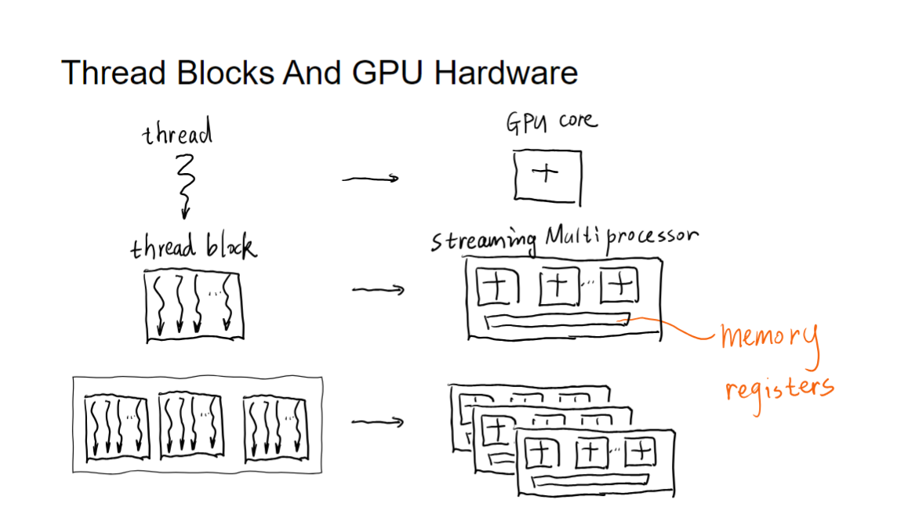
GPU的计算结构：抽象和具体的对应

首先是thread对应着GPU的core，最小的计算单元。  
tread 集成为block，对应着GPU的SM（streaming multiprocessor），block内的thread可以共享shared memory。  
而register有每个thread自己私有的local memory。(不过这里的说法可能在定义上有些不通用，总之知道储存在register上面的数据是最快的就行)  
然后多个block组成grid，对应着GPU的device（整个GPU），block之间使用global memory进行通信。
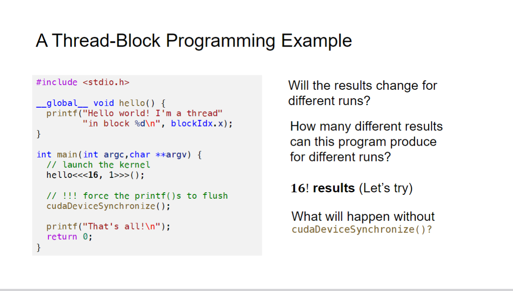

每个thread的运行顺序是无法保障的，于是哪个thread先运行是不可知道的，于是可能的结果就是16中idx进行排列，有16！种情况的result。

cudaDeviceSynchronize()：这个函数的作用是让所有的线程都运行完毕之后再继续往下执行。确保先把gpu的kernel运行完毕再继续往下执行cpu的代码。确保“That's all!”会在上述结束了之后再打印。

但是对于GPU内部来说，cuda进行了一些并行化的保证：  

CUDA 保证的内容体现了其异步、并行和分层同步的特性。以下是具体的解释：

### CUDA 的保证 (What does CUDA guarantee)

1.  **关于线程块的运行位置和时间，CUDA 提供的保证很少** 。
    * **并行执行**：不同的线程块和线程是并行运行的。
    * **不确定性**：程序员不能依赖线程块具体的执行顺序、开始时间或在哪一个特定的 SM 上运行。这种设计是为了让 GPU 调度器能够最大限度地利用硬件资源，提高效率、简洁性和可扩展性 

2.  **一个线程块内的所有线程都会在同一个 SM (Streaming Multiprocessor) 上同时运行** 
    * **意义**：这是**线程块内协作**的基础。正因为这个保证，线程块内的线程才能安全地使用 **Shared Memory** 和 **`__syncthreads()`** 屏障来进行同步和通信 

3.  **一个 Kernel 中的所有线程块都会在下一个 Kernel 中的任何线程块开始运行之前完成** 
    * **意义**：这是一个**Kernel 之间**的隐式同步保证。它确保了如果您连续启动两个 Kernel（例如 `kernel1<<<...>>>()` 和 `kernel2<<<...>>>()`），第一个 Kernel（`kernel1`）处理的所有数据操作都将先于第二个 Kernel（`kernel2`）的任何操作完成。
    * **注意**：如果 Host（CPU）代码需要在 `kernel1` 完成后才能执行，程序员仍然需要使用 `cudaDeviceSynchronize()` 或 CUDA 事件 API 进行**显式同步**，因为 Host 和 Device（GPU）是异步运行的 


### SIMT: 单指令多线程

#### 解释 (Explanation)

  * **定义**：SIMT 是一种执行模型，GPU 的多处理器（即 SM）以 32 个并行线程的组来创建、管理、调度和执行线程，这些组被称为 **Warp**（线程束）。
  * 也就是说，block中的线程被划分为多个 Warp，每个 Warp 包含 32 个线程（如果 block 中的线程数不是 32 的倍数，最后一个 Warp 可能包含少于 32 个线程）。
  * 最重要的是，我们要知道：一个 Warp 在同一时间执行**一条公共指令** 
  * 所以，当一个 Warp 中虽然执行的指令相同但是时间不同时，先执行完的线程必须要等其他的全部完成后才会继续执行，于是产生了waiting和浪费
#### 线程发散 (Branch Divergence)

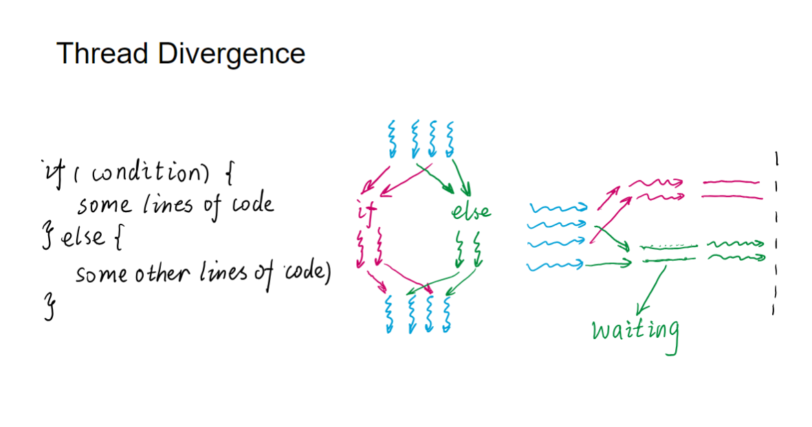
  * **发生条件**：如果一个 Warp 中的线程通过**依赖于数据的条件分支**（例如 `if/else` 语句）发生**发散 (diverge)**，那么 Warp 会顺序执行每个被采用的分支路径
  * **影响**：对于不在当前执行路径上的线程，SM 会将其**禁用 (disabling)** 。这意味着，本来可以并行执行的代码，现在需要串行执行分支路径，从而导致性能下降。
  * **限制**：分支发散**只发生在 Warp 内部** 。不同的 Warp 之间是独立执行的，无论它们是否执行相同的或不同的代码路径 

-----

### 示例说明 (Example)

假设有一个 Warp 包含 32 个线程，其线程索引 `threadIdx.x` 从 0 到 31。

**1. 无发散（高效执行）**

假设代码如下：

```cpp
__global__ void my_kernel(float* data) {
    int idx = threadIdx.x + blockDim.x * blockIdx.x;
    data[idx] = data[idx] + 1.0f; // 所有线程执行相同的指令
}
```

  * **结果**：所有 32 个线程（整个 Warp）都在同一时间并行地执行 `data[idx] = data[idx] + 1.0f;` 这条指令。**效率达到最高**。

**2. 发生发散（效率降低）**

假设代码中存在一个依赖于线程索引的条件分支：

```cpp
__global__ void my_kernel(float* data) {
    int idx = threadIdx.x;
    if (idx < 16) {
        // 路径 A
        data[idx] = data[idx] * 2.0f; 
    } else {
        // 路径 B
        data[idx] = data[idx] / 2.0f;
    }
}
```

  * **线程分组**：
      * 线程 0 到 15（共 16 个）满足 `idx < 16`，将走向**路径 A**。
      * 线程 16 到 31（共 16 个）不满足 `idx < 16`，将走向**路径 B**。
  * **执行过程（串行化）**：
    1.  Warp 执行指令，进入 `if (idx < 16)`。
    2.  **第一阶段**：Warp 执行**路径 A** 的指令。此时，线程 0-15 处于**激活**状态；线程 16-31 被**禁用/闲置**。
    3.  **第二阶段**：Warp 执行**路径 B** 的指令。此时，线程 16-31 处于**激活**状态；线程 0-15 被**禁用/闲置**。
    4.  最后，所有线程在 `if/else` 结构之后重新汇合。
  * **结果**：为了执行两条不同的路径，Warp 花费了**两倍**的时间周期（串行执行）。虽然代码逻辑是正确的，但因为 SIMT 架构，线程发散导致了性能下降。

同样的，对于for来说也是一样
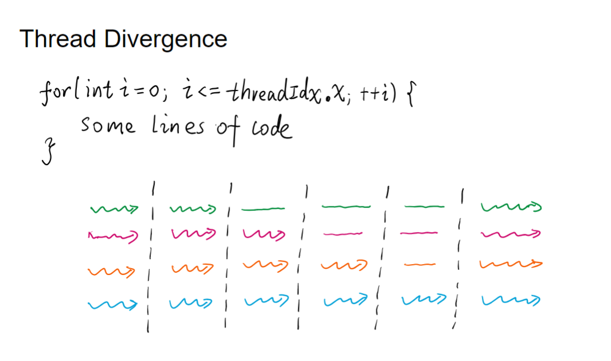

需要等最长的那条foe路径完成之后，wrap才会继续执行下一个指令


---


### 线程同步 (Thread Synchronization) 解释

并行编程中，线程协作的基础和挑战在于对内存的访问。

#### 1. 线程协作的方式

* **内存访问**：并行线程可以通过 **Global Memory (全局内存)** 和 **Shared Memory (共享内存)** 访问彼此的计算结果，从而实现协作。

#### 2. 潜在问题 (Caveat)

如果不对线程的内存访问进行协调，可能会出现**数据竞争 (Data Race)**，导致结果错误或不可预测。常见的问题包括：

* **错误的读取时机**：一个线程在另一个线程还没有写入结果之前就读取了该结果。
* **多线程写入竞争**：多个线程同时写入同一个内存位置（例如，执行累加求和 sum 操作）。

#### 3. 同步的必要性

* **目的**：线程需要进行**同步**才能安全地协作。

#### 4. 屏障 (Barrier)

* **定义**：屏障是实现同步的一种机制。它在程序中是一个确定的点，所有线程到达该点后会**停止并等待**。
* **执行**：只有当所有线程都到达屏障后，它们才能继续执行后续的程序代码。
* **图示**：图片右侧的图示直观地显示了这一点：多条波浪线（代表并行线程）在虚线（代表屏障）处停止，直到所有线程都到达后才一起继续向下执行。

在 CUDA 中，线程块内的线程同步就是通过 `__syncthreads()` 屏障来实现的。
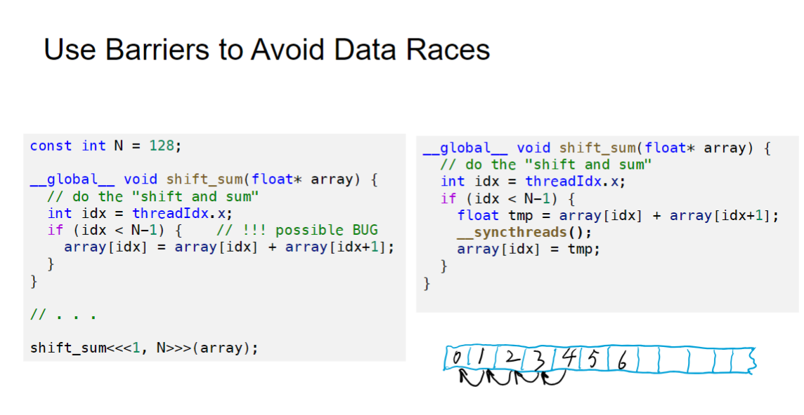
我们通过例子来分析  
左图中，每个线程的顺序不一样，所以可能出现比如idx=2的先执行完，然后idx=1的在执行的时候数据已经错了。  
而右图，先让数据存在tmp这个储存在寄存器的局部变量中，然后通过__syncthreads()来进行同步，确保所有线程都执行完上面的代码之后再进行下面的代码，这样就不会出现数据错乱的问题了。

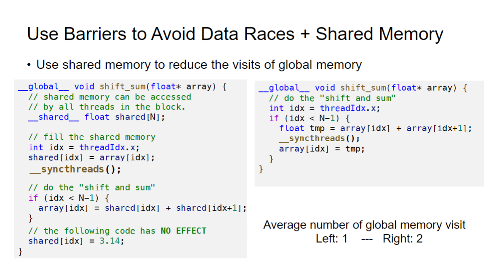
还有更加优化的方法  
我们发现，前面说的方法在计算tmp和将tmp赋值回array的时候，这样的操作进行了两次对global memory的访问，两次读取，一次写入，效率较低。  
我们给出了左边的方法：将array先映射到shared memory中，然后进行计算，最后再写回global memory。这样就只需要一次读取，一次写入，效率更高。同时也顺带解决的了数据竞争的问题。  
tips：竞争发生“写”操作（多个thread同时写入同一个地址会有问题），读取read是不会竞争的

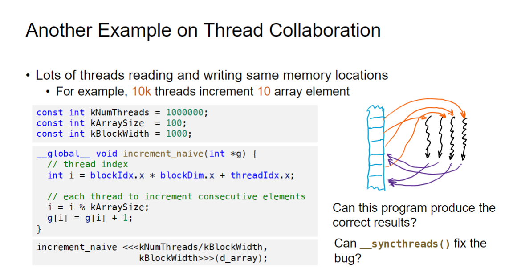
这是一个很好的例子，这是另一种情况的数据竞争，而且无法通过__syncthreads()来解决。  
我们的方法是调用atomicAdd(&array[idx], value);，这个函数的作用是确保对array[idx]的加法操作是逐一发生的，也就是在一个线程进行操作的时候（读取或者写入），把另外也要操作这个内存地址的线程给阻塞住，等这个线程写完了再进行下一个线程的写入。这样就避免了数据竞争的问题。

但是原子操作也有局限：  

### 原子内存操作的局限性 (Limitations of Atomic Memory Operations)

虽然原子操作可以解决多线程写入竞争的问题，但它们也带来了两个主要缺点：

#### 1. 结果不完全可复现 (The results are not fully reproducible)
[cite_start]使用原子操作时，程序的执行结果在多次运行时可能不完全相同 [cite: 231]。

* [cite_start]**示例 1：求和**：对求和 $s = \sum_{i=1}^{N} x_i$ 进行多次运行时，可能会产生不同的结果 [cite: 232]。
    * **原因**：虽然原子操作保证了计算的正确性，但并行浮点运算（如加法）的**结合律**在计算机上可能不成立。不同的线程执行顺序（由原子操作决定）会导致不同的加法顺序，进而由于浮点数的舍入误差累积产生略微不同的最终结果。
* [cite_start]**示例 2：神经网络训练**：即使固定了随机种子，多次运行神经网络训练，得到的最终权重也可能不同 [cite: 233]。

#### 2. 内存访问的串行化 (Serialize the memory access)
[cite_start]原子操作是通过确保一次只有一个线程访问内存位置来实现线程安全的 [cite: 234]。

* [cite_start]**影响**：这种机制将原本可以并行执行的内存访问操作**串行化**了 [cite: 234]。
* [cite_start]**结果**：这会**大大降低程序的运行速度** [cite: 235]。

## Measure Speed

我们期望测量程序的运行时间，从而评估优化的效果。  
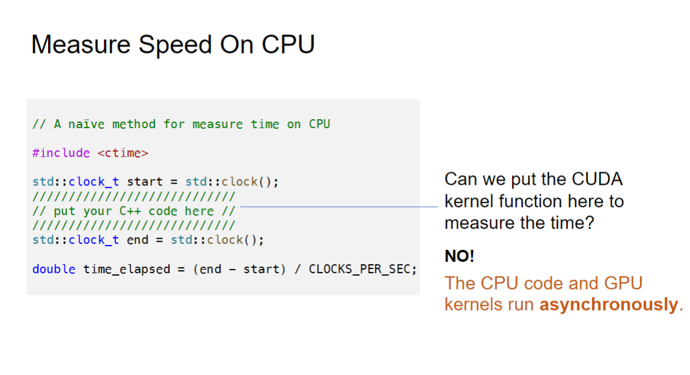

GPU和CPU是异步（asynchronous）的，启动kernel之后就不会管了，不回自动等待对方完成，所以cpu的时间测量无法测量gpu的时间。

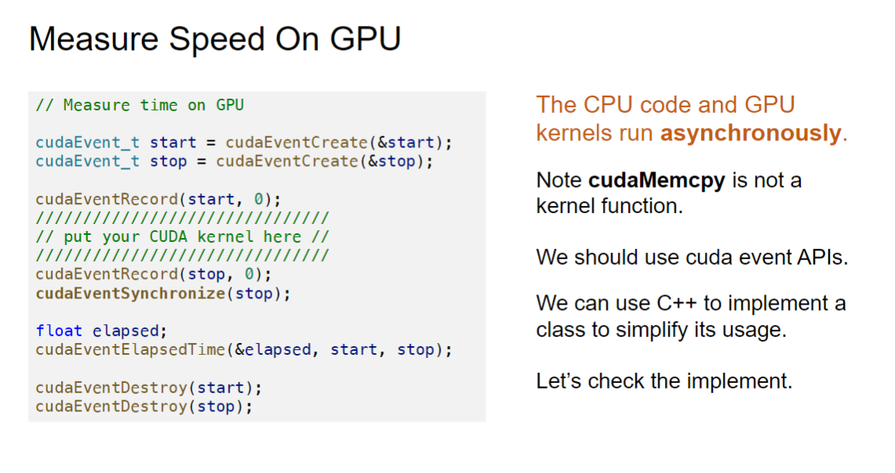
这是gpu测量kernel执行时间的代码示例：  
先创建两个gpu事件对象，用来记录时间点，然后用record函数记录开始和结束时间  
强制同步：由于 Kernel 是异步的，为了确保 Kernel 实际执行完成，必须调用 cudaEventSynchronize(stop)，强制 CPU 等待 stop 事件记录完成  
然后通过cudaEventElapsedTime函数计算两个事件之间的时间差，从而得到Kernel的执行时间。  
最后销毁事件对象，释放资源。  
可以将上述操作封装成一个类，方便重复使用。  

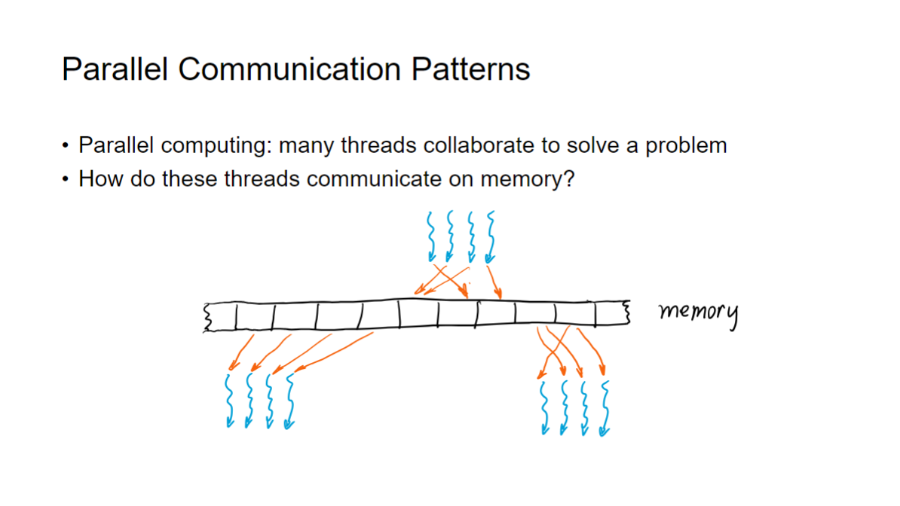
好的，您提供的图片介绍了**并行通信模式 (Parallel Communication Patterns)** 的主题。

### 并行通信模式 (Parallel Communication Patterns) 解释

* [cite_start]**并行计算**：并行计算的本质是让许多线程协作来解决一个问题。
* [cite_start]**核心问题**：要实现协作，这些线程必须在内存上进行**通信** 。
* **通信方式**：图片下方展示了线程和内存之间的几种抽象数据流动方式，这些流动定义了不同的通信模式：
    * **线程到内存**（例如，线程写入内存）：图片中蓝色波浪线箭头指向内存。
    * **内存到线程**（例如，线程从内存读取）：图片中橙色箭头指向线程（蓝色波浪线）或从内存指向线程。
* **模式示例**：图片展示了集中和分散的通信模式：
    * **多对一**：左上方，多个线程（蓝色波浪线）将数据写入少数几个内存单元（例如，求和操作，这是 **Gather** 或 **Reduce** 的基础）。
    * **一对多**：右下方，少数几个内存单元的数据被多个线程读取（例如，数据广播，这是 **Scatter** 或 **Map** 的基础）。

接下来的内容（如 Map、Gather、Scatter、Stencil、Transpose）将详细解释这些不同的通信模式是如何分类和应用的。

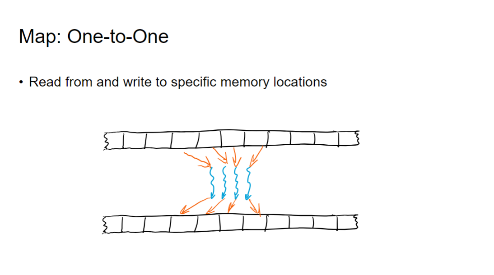
* Map：一对一 (One-to-One)
* 定义：Map 模式是一种最简单的并行通信模式，它涉及从特定的内存位置读取数据，并将结果写入对应的特定内存位置 。

* 通信特点：输入数据和输出数据之间存在一对一的映射关系 。每个线程独立工作，通常只负责处理一个输入元素并计算出一个输出元素 。

图示中，上方的内存单元被读取（橙色箭头），下方的内存单元被写入（橙色箭头），每个线程（蓝色波浪线）独立地从上方内存的一个位置读取并写入下方内存的一个位置，数据流是局部的、一对一的。  
激活函数（例如 ReLU、Sigmoid、Tanh）的计算是 Map 模式的典型应用

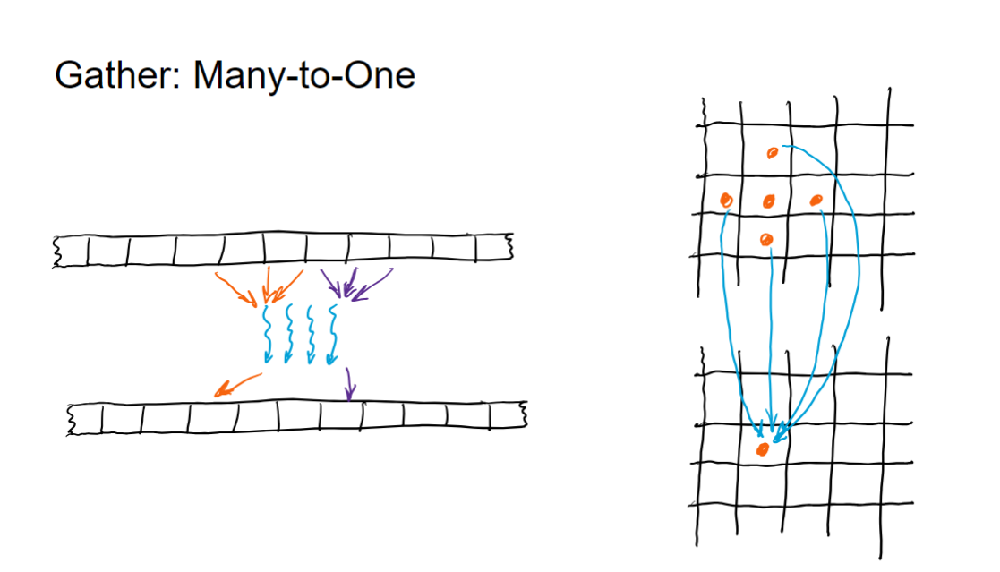

### Gather：多对一 (Many-to-One)

* **定义**：Gather 模式是一种并行通信模式，它涉及**多个输入位置**的数据流向**一个或少数输出位置**。
* **通信特点**：多个线程从不同的输入位置读取或计算数据，并将这些结果汇集（“聚集”）到目标内存中的一个或少数几个位置。
* **图示**：
    * **左侧一维图**：多个线程（蓝色波浪线）从上方内存的不同位置读取数据（橙色/紫色箭头），但最终都指向下方内存的**一个**输出位置。
    * **右侧二维图**：上方网格中多个橙色圆点（代表输入数据）的数据通过蓝色箭头聚集到下方网格中的**一个**橙色圆点（代表输出位置）。

### 举例解释：全局求和 (Global Reduction Sum)

在并行计算中，计算一个大数组或向量的所有元素的**总和（Reduction Sum）**是 Gather 模式的典型应用。

假设有一个包含 $N$ 个元素的数组 $X$，我们希望计算 $\sum_{i=0}^{N-1} X_i$。

* **操作**：将所有元素的值累加到一个最终结果变量中。
* **并行实现**：
    1.  **分步计算**：首先，将 $N$ 个线程分组，每组线程计算一部分元素的局部和。
    2.  **Gather 过程**：在最终阶段，多个线程（或多个线程组的代表）将它们的**局部结果**（多个输入）都累加到**同一个全局求和变量**（一个输出位置）中。
    3.  **关键点**：由于多个线程在向同一个内存位置写入（累加求和），为了保证数据正确性，这个最终的汇集操作必须使用 **原子操作**（如 `atomicAdd`）或通过 **同步屏障和共享内存** 逐步完成。

因此，Gather 模式的核心是多个数据源聚集到一个公共的目标。

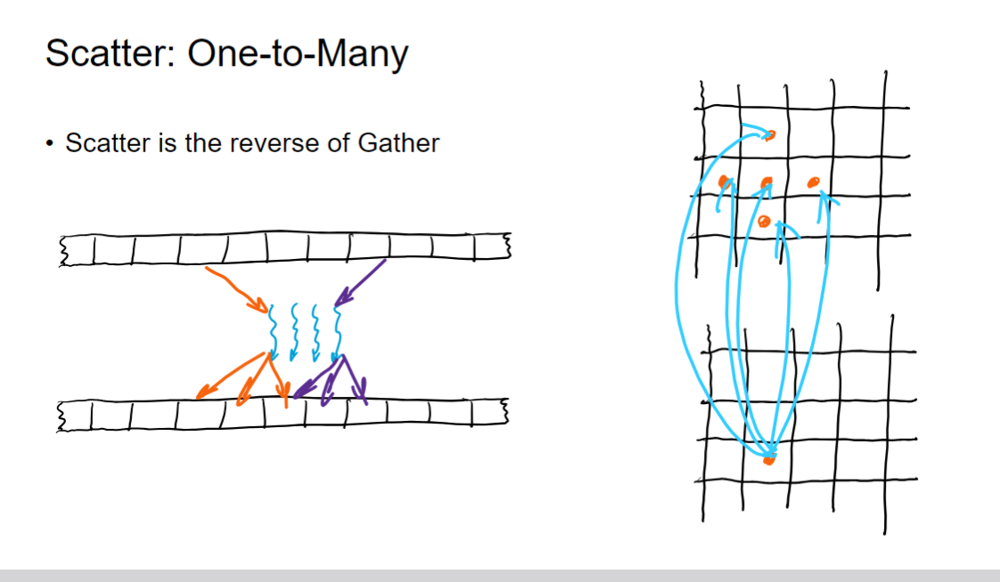

### Scatter：一对多 (One-to-Many)

* [cite_start]**定义**：Scatter 模式是 **Gather 模式的逆向操作** [cite: 322]。它涉及从**一个或少数输入位置**读取数据，并将这些数据发送到**多个输出位置**。
* **通信特点**：一个线程或一个内存单元的数据被分散（“散布”）到不同的目标内存位置，通常用于数据的复制或广播。
* **图示**：
    * **左侧一维图**：多个线程（蓝色波浪线）从上方内存的一个或少数几个位置读取数据（橙色/紫色箭头），并写入下方内存的**多个**不同输出位置。
    * **右侧二维图**：下方网格中的一个橙色圆点（代表输入数据）通过蓝色箭头将数据分散到上方网格中的**多个**橙色圆点（代表输出位置）。

### 举例解释：数据广播或权重更新

#### 1. 数据广播 (Broadcasting)
如果需要将一个单一的常数值或一个小的向量复制到大数组的多个位置，或者将一个共享的权重广播给多个线程使用，就可以使用 Scatter 模式。

* **场景**：在一个大型矩阵的多个行或列中填充同一个标量值。
* **并行实现**：
    * 启动线程。
    * 每个线程从**一个共享的内存位置**读取相同的标量值（例如，一个学习率 $\alpha$）。
    * 每个线程将这个值写入自己负责的输出数组中的**不同位置**。

#### 2. 梯度反向传播（局部数据更新）
在深度学习的反向传播中，虽然梯度累加是 Gather (多对一) 的，但将一个单一的更新值（例如，一个标量偏差项的梯度）应用于多个输出元素的过程可以是 Scatter 模式。

例如，一个线程可能负责计算一个共享变量 $V$ 的新值，然后这个新值被多个线程读取，并用于更新它们负责的不同输出位置 $Y_i$。

Scatter 模式的核心是：**少量数据源，大量数据目标**。

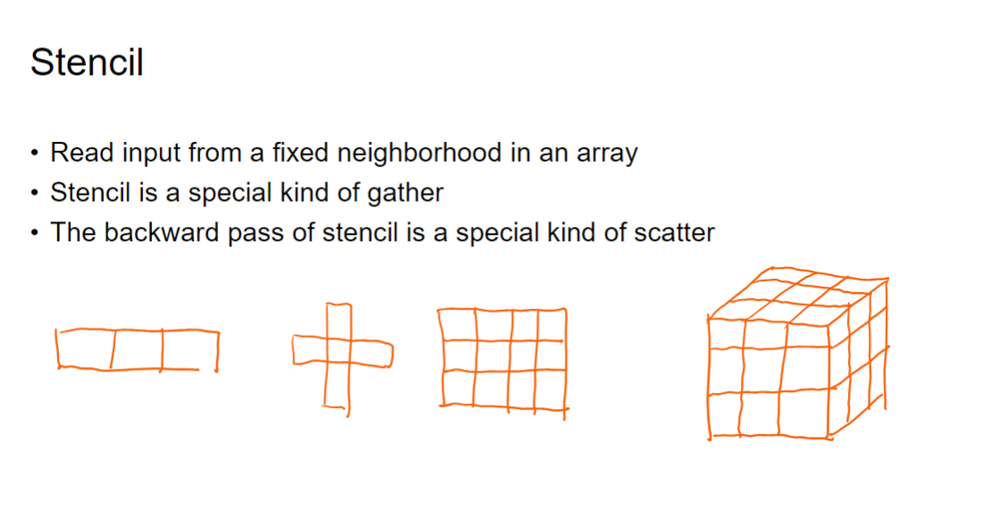


### Stencil (模板/核) 模式解释

* [cite_start]**定义**：Stencil 模式是一种特殊的通信模式，它涉及从数组中**一个固定的邻域**读取输入数据 [cite: 324]。
* **特性**：
    * [cite_start]Stencil 是一种特殊形式的 **Gather (聚集/多对一)** 模式 [cite: 325]。因为它从多个输入位置（邻域）读取数据，计算后汇集到一个输出位置。
    * [cite_start]Stencil 的反向传播过程是一种特殊形式的 **Scatter (散布/一对多)** 模式 [cite: 326]。因为一个输出位置（或梯度）的值会被分散到其固定的输入邻域中。
* **图示**：图片中展示了不同维度和形状的“模板”或“核”：一维的线段、二维的十字形、二维的网格以及三维的立方体网格。这些形状代表了在计算一个输出点时，需要从输入数组中读取的**固定邻域**。

### 举例解释：卷积 (Convolution)

在深度学习和图像处理中，**卷积 (Convolution)** 是 Stencil 模式最典型的应用。

假设有一个输入图像（二维数组），以及一个小的卷积核（Kernel）。卷积操作计算输出图像的一个像素 $P_{out}$：

1.  **输入读取**：在计算输出图像的像素 $P_{out}$ 时，需要从输入图像中读取一个**固定大小的邻域**（例如 $3\times3$ 或 $5\times5$ 的区域），这个邻域的形状和大小由卷积核决定。
2.  **计算**：将读取的邻域数据与卷积核进行乘加运算，得到输出像素 $P_{out}$ 的值。
3.  **模式对应**：
    * **多对一**：多个输入像素（一个邻域）**聚集**计算出一个单一的输出像素 $P_{out}$。这符合 Stencil 是特殊 Gather 的特性。

因此，卷积操作完全符合 Stencil 模式的定义：从数组中读取一个固定的邻域进行计算。

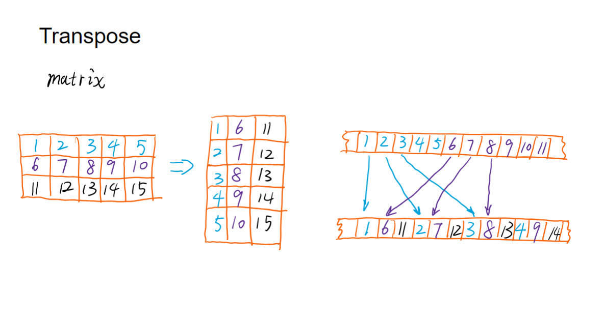

转置也是一种1对1的操作，只不过是输入和输出的位置互换了。然而，这种映射关系是非连续且具有固定规律的，涉及到数据的重新排列。  
在 GPU 上实现转置是很困难的，因为：

* 读取输入矩阵时，如果按行读取是连续的，那么写入输出矩阵时就是不连续的。

* 反之，如果写入输出矩阵时是连续的，那么读取输入矩阵时就是不连续的。

这种不连续的内存访问模式（非合并访问）会严重影响 GPU 的性能，因此高效的转置 Kernel 需要复杂的优化技术，例如使用共享内存来缓存数据并进行分块转置。


另一个例子： 结构数组 (Array of Structures) 到 数组结构 (Structure of Arrays) 的转换。

通过将这种简短的结构体数据排布转为连续的数组类型数据，在不改变数据的逻辑内容的条件下，但通过改变数据的物理存储布局，显著提高了 GPU 并行编程中的内存访问效率。

# 3&4 Parallel Algorithm

## reduce(并行归约：parllel reduction)

首先指出两个概念：工作复杂度 (Work Complexity) 和 步长复杂度 (Step Complexity)
* 工作复杂度 (Work Complexity) ：表示算法在总共执行了多少基本操作，通常与输入数据的大小成正比。例如，对于一个包含 n 个元素的数组，计算其总和的工作复杂度是 O(n)，因为需要遍历所有元素进行累加。
* 步长复杂度 (Step Complexity) ：用于计算并行算法的复杂度，我们认为有无限多的处理单元（线程），那么算法在多少步内可以完成。这个指标反映了算法在并行环境下的效率。例如，在并行归约算法中，通过将数据分成多个部分并行处理，可以将步长复杂度降低到 O(log n)，因为每一步可以同时处理多个元素。
  
我们经常需要计算sum和mean等操作，这些操作本质上是将大量数据归约到一个结果上。  
我们希望通过并行算法来加速这些操作。  

* 从cpu的角度来说，执行sum操作的时间复杂度是O(n)，因为需要遍历所有数据进行累加。  
* 从gpu的角度来说,我们通过归并的方法进行计算，每一行认为可以并行处理，于是步长复杂度为O(log n)。如图：
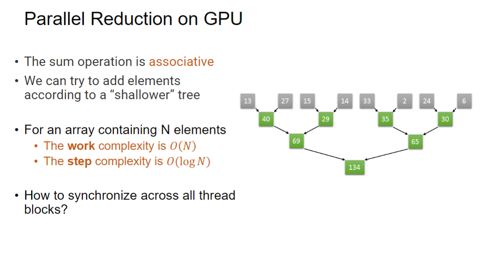

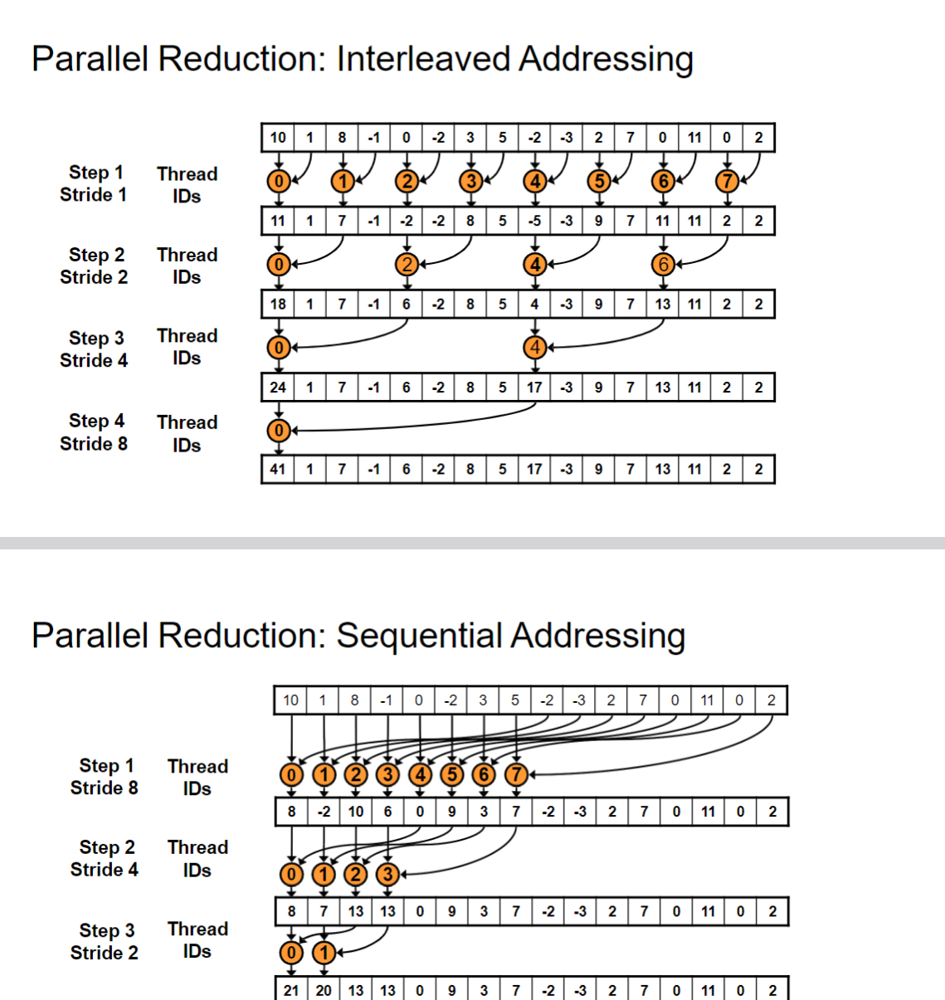
其中有两种寻址模式：交错(sequential addressing)和顺序(sequential addressing)  
第二种方法更好，因为第一种方法会导致内存访问不连续，效率低下。  

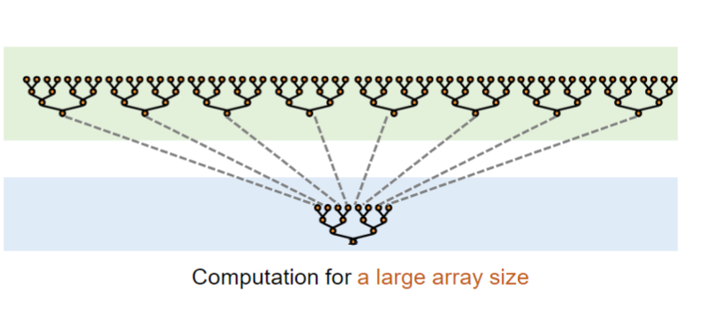
当数组很大的时候，我们在每个block中进行局部归约，然后将每个block的结果再进行归约，最终得到全局的结果。

我们可以通过将过程放在shared memory中进行加速。对比在global memory中进行归约的效率和shared memory中进行归约的效率：
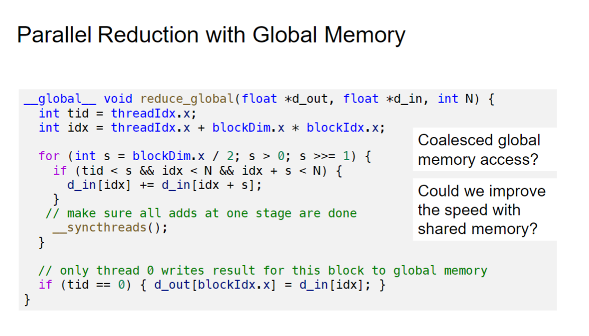
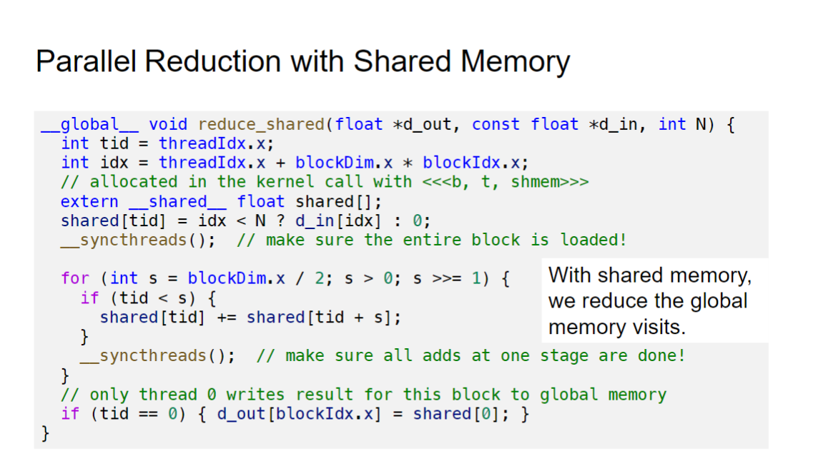

使用shared memory进行优化基本上第一步都是先把数据从global memory读到shared memory中，然后在shared memory中进行归约，最后再把结果写回global memory中。


最终cpu中的函数实现

## Scan (并行前缀和：parallel prefix sum)
效果是这样的：


我们可以用它来做到数组掩码：
$A=[0,1,2,3,4,5,6,7,8,9]$  
$mask=[0,1,0,1,1,0,0,1,0,1]$      
我们希望得到$[1,3,4,7,9]$  
通过scan操作，我们可以得到前缀和：
$prefix\_sum(mask)=[0,1,1,2,3,3,3,4,4,5]$
一一对应，前缀和对应的就是元素的位置

如果再cpu上，就是简单的循环。在gpu上，我们设计并行算法来进行处理：  
The step complexity is $O(\log N)$  
The work complexity is $O(N^2)$  
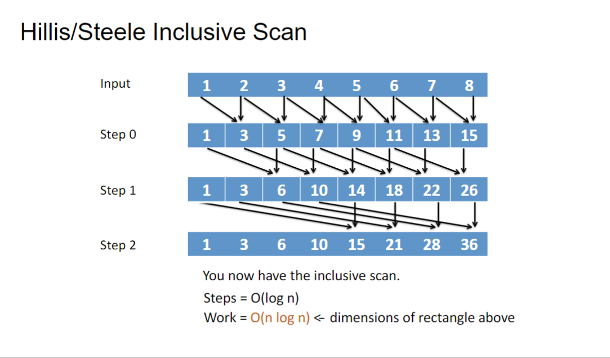

#### 应用条件
* **Parallel scan requires the operator to be binary and associative.** (并行扫描要求操作符是二元和可结合的。)
    * **二元 (Binary):** 操作符接受两个输入。
    * **可结合 (Associative):** 这是最关键的数学条件。对于操作 $\oplus$，如果满足 $(a \oplus b) \oplus c = a \oplus (b \oplus c)$，则它是可结合的。只有满足可结合律，才能将计算任务分解成独立的子任务，并在不同阶段将子结果合并，而结果不发生变化。这是所有并行归约和扫描算法的基础。
* **SUM, MULTIPLY, MIN, MAX, AND, OR** (求和、相乘、最小值、最大值、AND、OR)
    * 这些是常见的、满足可结合律的操作，因此都可以用于并行扫描。例如，可以计算前缀积 (Prefix Product) 或前缀最小值 (Prefix Minimum)。

## Transpose
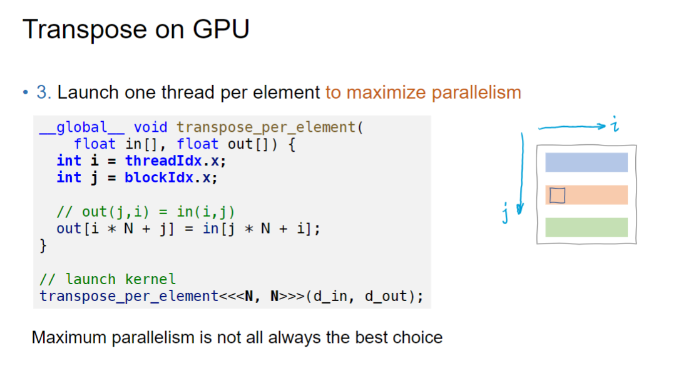
好的，这张幻灯片的主题是**在 GPU 上进行矩阵转置 (Transpose on GPU)**，并展示了一种尝试最大化并行度的简单实现，但随后提出了对该方法的警告。

### **代码及实现解释**

#### 1\. 目标

  * **3. Launch one thread per element to maximize parallelism** (为每个元素启动一个线程以最大化并行度)
      * 这是实现转置的朴素（或称天真）方法：为输入矩阵中的每一个元素分配一个独立的 GPU 线程来处理。

#### 2\. GPU 内核代码 (`transpose_per_element`)

这段代码展示了一个简单的转置逻辑：将输入矩阵 `in` 的元素 $(j, i)$ 复制到输出矩阵 `out` 的元素 $(i, j)$。

```c++
__global__ void transpose_per_element(float in[], float out[]) {
    // 假设输入矩阵是 N x N 的方阵
    int i = threadIdx.x; // 线程在块内的索引 (列索引，或行索引)
    int j = blockIdx.x;  // 线程块的索引 (行索引，或列索引)

    // // out(j, i) = in(i, j) 
    // out[i * N + j] = in[j * N + i]; 
}
```

**对索引的解释：**

  * **二维到一维的映射：** 计算机内存通常是一维的。对于一个 $N \times N$ 的矩阵，元素 $(r, c)$ 的一维索引通常是 $r \times N + c$ (行主序)。
  * **输入索引 `in[j * N + i]`：** 对应于输入矩阵的 $(j, i)$ 位置。这里假设 $j$ 是行索引（由 `blockIdx.x` 确定），$i$ 是列索引（由 `threadIdx.x` 确定）。
  * **输出索引 `out[i * N + j]`：** 对应于输出矩阵的 $(i, j)$ 位置。

**内核启动配置：**

```c++
// launch kernel
// 假设矩阵是 N x N 的，且 N 是线程块大小的整数倍
transpose_per_element<<<N, N>>>(d_in, d_out);
```

  * **配置：** 启动 $N$ 个线程块（`<<<N`），每个线程块有 $N$ 个线程（`, N>>>`）。
  * **总线程数：** $N \times N = N^2$，恰好等于 $N \times N$ 矩阵的元素总数。这实现了“为每个元素启动一个线程”的目标。

-----

### **底部结论的解释**

**Maximum parallelism is not all always the best choice (最大并行度并非总是最佳选择)**

这句总结是对前面简单实现的一个**关键警告**，它指出了这种**朴素转置实现**在 GPU 上的主要性能问题：

1.  **全局内存访问非合并（Non-Coalesced Global Memory Access）：**

      * GPU 线程块是按行或按块访问内存时效率最高（内存合并）。
      * 在转置操作中，当线程 $j$ 访问**输入矩阵**的行 `j`（`in[j * N + ...]`）时，通常是合并的。
      * 但是，当这些线程试图写入**输出矩阵**的**列** $j$（`out[... + j]`）时，它们访问的地址在内存中是**不连续**的（因为是列访问），导致：
          * **输出写入是分散的，严重不合并。**
          * **性能大幅下降。**

2.  **写冲突和 Bank 冲突（如果使用共享内存）：**

      * 即使优化到使用共享内存（虽然这段代码没用），这种简单的转置访问模式也会导致严重的**共享内存 Bank 冲突**，因为线程束中的线程会竞争访问共享内存中的不同行，但这些行可能映射到相同的 Bank。

因此，虽然“为每个元素启动一个线程”听起来很并行，但它是一种**对硬件不友好**的访问模式。高效的 GPU 转置算法必须采用**分块（Tiled）** 和**共享内存**技术，将数据块先载入快速的共享内存，在共享内存中进行转置，然后再以合并的方式写回全局内存。

**总结：** 这句话强调了 GPU 编程的一个核心原则：**只最大化线程数量是不够的，你必须同时优化内存访问模式（尤其是合并访问）才能获得真正的性能提升。**

于是我们分块转置和共享内存来进行优化：  
图示：  
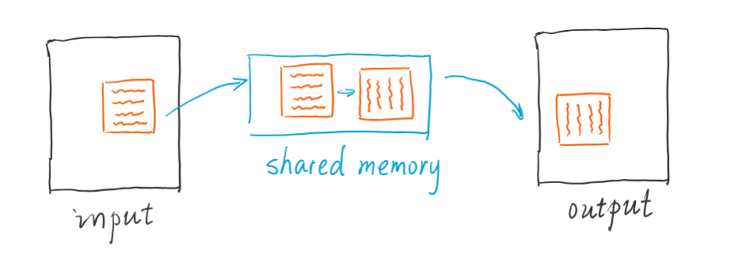


## Sort
我们来看在GPU上是如何实现并行的归并排序的：
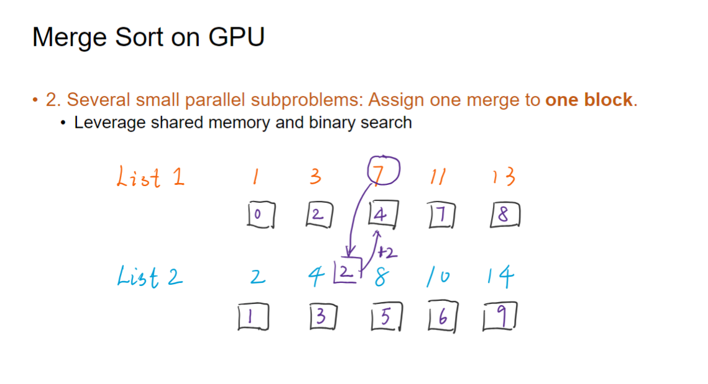
首先，任务被分成三个阶段：  
阶段1：多个小的独立子问题：为每个小排序分配一个线程块。   
阶段2：几个中等大小的并行子问题：为每个归并分配一个线程块。    
阶段3：一个大归并问题：使用多个线程块协同完成一个大归并。  
阶段一就是简单的线程计算。来看阶段二和三
### 1. 归并阶段 2 的目标和工具

* **阶段 2. Several small parallel subproblems: Assign one merge to one block.**
    * **目标**：合并两个中等大小的已排序子序列。
    * **分配**：将整个归并任务分配给**一个线程块**来完成。
    * **工具**：**`Leverage shared memory and binary search`**
        * **共享内存 (Shared Memory)**：用于缓存 List 1 和 List 2 的数据，实现快速访问。
        * **二分查找 (Binary Search)**：这是实现高效并行归并的关键工具。

### 2. 并行归并的核心思想（使用二分查找）

传统的串行归并是使用两个指针，依次比较两个列表的头部元素。但在 GPU 上，我们希望所有线程能**同时**工作。

并行归并的核心思想是：将最终的归并结果数组均匀地分配给线程块内的所有线程。每个线程负责计算并放置**结果数组的某一部分**。

#### 步骤：

1.  **数据加载**：线程块内的所有线程协作，将 List 1 和 List 2 的数据从全局内存加载到**共享内存**中。
2.  **工作分配**：线程块内的每个线程（或一部分线程）被分配到结果数组中的一个或几个位置。
3.  **计算位置（二分查找）**：
    * **每个线程**拿到它在 List 1 或 List 2 中分配到的一个特定元素（称为**基准元素**）。
    * **该线程使用** **二分查找** **去查找这个基准元素在** **另一个列表** **中的插入位置。**

#### 3. 图片中的示例分析

图片展示了 List 1 中的元素 `7` 如何利用二分查找计算其在最终归并结果中的位置：

* **List 1**： $\left[1, 3, \underline{7}, 11, 13\right]$
    * 索引（在 List 1 中）：$\left[0, 2, \underline{4}, 7, 8\right]$
* **List 2**： $\left[2, 4, 8, 10, 14\right]$
    * 索引（在 List 2 中）：$\left[1, 3, 5, 6, 9\right]$

假设某个线程被分配处理 List 1 中的元素 $\underline{7}$：

1.  **二分查找**：线程在 **List 2** $\left[2, 4, 8, 10, 14\right]$ 中执行二分查找，找到 $\underline{7}$ 的插入位置。
2.  **查找结果**：元素 `7` 应该插在 `4` 和 `8` 之间。
    * 在 List 2 中，比 `7` 小的元素有 `2` 和 `4`，共 **2** 个元素。
3.  **计算最终位置**：
    * `7` 在 **List 1** 中的索引是 **4**。
    * `7` 在 **List 2** 中前面有 **2** 个元素比它小。
    * `7` 在最终归并结果中的位置是： List 1 中的索引 + List 2 中前面比它小的元素个数
        $$\text{Position}(\text{element}) = \text{Index in List 1} + \text{Count of smaller elements in List 2}$$
        $$\text{Position}(7) = 4 + 2 = 6$$

* **箭头的意义**：
    * 箭头从 `7` 指向 List 2 中的 `8` 和 `4` 之间的位置，表示通过二分查找确定了**分隔点**。
    * 箭头旁边标着 **`+2`**，表示在 List 2 中比 `7` 小的元素有 2 个。

### 总结

这种方法将归并操作转化为一个**并行求和**问题：每个线程负责确定一个元素在最终结果中的精确位置。由于二分查找的复杂度是 $O(\log N)$，所以整个并行归并阶段的**步数复杂度**（Step Complexity）被降低到 $O(\log N)$，远优于串行归并的 $O(N)$，从而实现了高效的 GPU 并行化。  
从而，我们可以看到，整体的并行归并算法地step complexity是$O([\log(n)]^2)$


第三步，在块之间进行归并。我们将大的问题拆成小的归并问题，将长数组拆成小的array放在各个块中分别进行归并，最后将各个blocks地结果进行整合。ppt很抽象，我用例子来解释：  
例如对于两个已经排序好的数组A和B，我们希望将它们合并成一个排序好的数组C。
假设A和B分别是：$A=[a_1, a_2, a_3, a_4]$，$B=[b_1, b_2, b_3, b_4]$  
那么我想要以$a_2$为基准抽出一部分进行部分的归并，并且使得归并地结果可以无缝直接合并到最终结果上（相当于我们得到了$C_1$,最后的目标结果是$[C_1,.....]$）。我们只需要找到$b_k$，使得$b_k$是B中第一个大于$a_2$的元素，那么我们就可以知道，$C_1$应该是$[a_1, a_2, b_1, b_2, ..., b_{k-1}]$进行归并排序后的结果。这里找到这样的$b_k$就可以通过二分查找来实现。  
至于选择哪个$a_i$作为分割的基准，应该根据数组大小和想要分割的长度来确定，此处不表。

## Sorting Network

太多了不想写了）  
之后会通过排序网络说明另外一种复杂度为O(log^2 n)的并行归并方法——双调排序网络（Bitonic Merging）。  
那么之前的方法和现在这种双调排序网络方法有什么区别呢？  
您说的“原有二分查找插入的归并方法”指的是我们前面讨论的 **GPU 归并排序阶段 2 和 3** 中使用的 **并行归并路径（Merge Path）** 方法。

这两种方法（归并路径 vs. 双调排序网络）都可以实现 $O(\log N)$ 的并行归并时间，但它们在**实现复杂度、普适性和硬件适用性**上有所不同：

### 比较：归并路径 (Merge Path) vs. 双调排序网络 (Bitonic)

| 特性 | 并行归并路径 (Merge Path) | 双调归并网络 (Bitonic Merging) |
| :---: | :---: | :---: |
| **理论复杂度** | 步数复杂度：$O(\log N)$ | 步数复杂度：$O(\log N)$ |
| **算法结构** | **数据相关/自适应** | **数据无关/固定** (排序网络) |
| **主要操作** | 复杂的**并行二分查找**来确定分割点，然后是**独立归并**。 | **固定的、预设的比较器序列**（半清洗器）。 |
| **硬件适用性** | **软件友好 (GPU)**：需要分支、线程控制和复杂的索引计算。 | **硬件友好 (FPGA/ASIC)**：结构固定，易于流水线化。 |
| **实现难度** | 索引计算复杂，涉及到多次内存访问和同步（尤其在跨块时）。 | 结构本身易于描述，但递归实现和线程映射需要仔细设计。 |
| **应用范围** | **归并排序**：专用于两个已排序数组的归并。 | **通用排序**：可用于归并，也可用于任意序列的完整排序。 |

### 为什么双调排序网络仍然重要？

在 GPU 归并排序中，虽然“归并路径”方法是主流且实用的选择，但“双调排序网络”仍然是并行算法理论和硬件实现的基石：

1.  **理论的完备性（Sorting Networks）**：
    * **双调排序**是构建于**排序网络**理论之上的。排序网络的结构是固定的、数据无关的。这使得它们在理论上具有优雅和简洁性。
    * **归并路径**方法虽然快，但它是一种**自适应算法**（每一步的行动依赖于数据的比较结果），在理论上属于不同的复杂度类别（通常不被称为排序网络）。

2.  **固定结构带来的优势（硬件）**：
    * **如果目标是硬件实现（例如在 FPGA 或 ASIC 上）**，双调排序网络的固定、规则的比较结构是无与伦比的。它可以转化为一个深度为 $O(\log^2 N)$ 的电路，实现纳秒级的排序。
    * **归并路径**的二分查找和分支结构，在硬件上的效率不如固定的比较器网络高。

3.  **小规模归并的简洁性**：
    * 对于非常小的子问题（例如 $N=16$ 或 $32$），**双调网络**可以转化为一个固定的 CUDA 模板，避免了复杂的线程索引和二分查找，可能比归并路径更简洁、更快速。

### 结论

在现代 GPU 编程中，您提出的**并行归并路径（二分查找归并）**方法是用于实现 $O(\log N)$ 并行归并的**最常用和最实用的**技术。

**双调排序网络**的意义更多在于：
1.  它是**理论上的优雅解**，证明了 $O(\log^2 N)$ 排序时间是可达的。
2.  它是**硬件实现**并行归并和排序的首选结构。

因此，在讲解 GPU 排序时，通常会介绍双调排序网络，以提供并行排序算法的**理论基础和另一种实现思路**。

## Radix Sort

一种新的，非直接比较的排序方法：基数排序（Radix Sort）。  
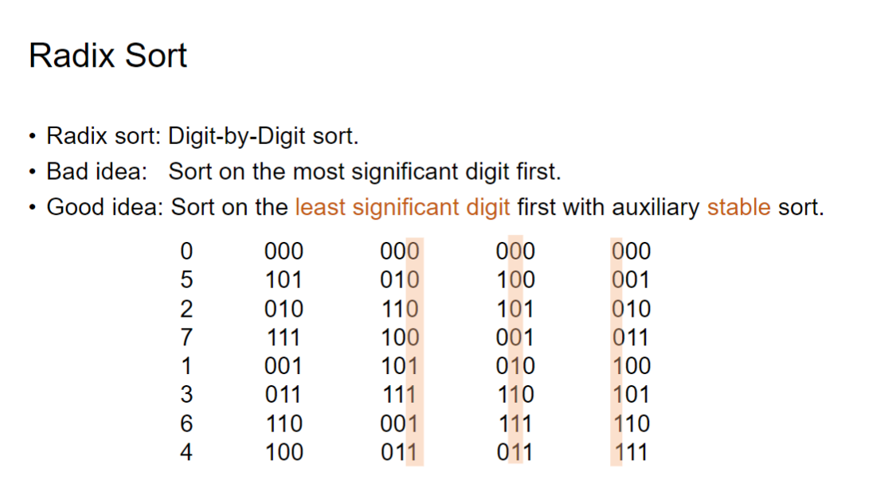
您提供的图片解释了**基数排序（Radix Sort）**的基本原理和正确的实现策略。

### 1. 基数排序的定义

* **Radix Sort: Digit-by-Digit sort.**
    * **定义**：基数排序是一种**非比较型**的排序算法。它的核心思想是**按位（或按数字）进行排序**。它对数字（或其他可分解为位的元素）进行操作，依次比较和安排它们的每一位数字。
    * **复杂度**：基数排序的时间复杂度通常是 $O(d \cdot (N + R))$，其中 $N$ 是元素数量，$d$ 是最大位数（或基数排序的轮数），$R$ 是基数（即每一位的取值范围，例如十进制中 $R=10$）。如果 $d$ 和 $R$ 较小，它的性能可以优于基于比较的 $O(N \log N)$ 算法。

### 2. 排序策略的选择（核心）

基数排序的关键在于从哪一位开始排序，以及使用哪种辅助排序算法。

* **Bad idea: Sort on the most significant digit first.**
    * **从最高位（MSD，Most Significant Digit）开始排序**：这种方法需要将数据分成许多桶，并对每个桶递归地进行排序。在并行计算中，这会导致大量的递归操作和不平衡的工作负载，效率较低。

* **Good idea: Sort on the least significant digit first with auxiliary stable sort.**
    * **从最低位（LSD，Least Significant Digit）开始排序**：这是基数排序的标准和高效做法。
        1.  **从右到左**，从最低位开始，依次对每一位进行排序。
        2.  **辅助稳定排序（Auxiliary Stable Sort）**：每一步的排序**必须**使用**稳定排序**算法（如计数排序 Count Sort）。
            * **稳定排序**：保证具有相同键值（当前位的值）的元素，在排序后它们的**相对顺序不变**。
            * **重要性**：只有稳定排序才能保证前一轮（较低位）排序的结果在后续的排序中得以保留。

### 3. 示例追踪（LSD 基数排序）

图片中的例子展示了将十进制数字转换为三位二进制数（$0$ 到 $7$），然后进行三轮 LSD 基数排序的过程。

| 十进制 | 初始状态 (三位二进制) | **第 1 轮：按最低位 (LSD)** | **第 2 轮：按中间位** | **第 3 轮：按最高位 (MSD)** |
| :----: | :----------------------: | :--------------------: | :------------------: | :--------------------: |
| - | **位值：** $2, 1, 0$ | **排序键：** 位 0 | **排序键：** 位 1 | **排序键：** 位 2 |
| **0** | **000** | 00**0** $\to$ **000** | 0**0**0 $\to$ **000** | **0**00 $\to$ **000** |
| **5** | **101** | 01**0** $\to$ 010 | 1**0**0 $\to$ 100 | **0**01 $\to$ 001 |
| **2** | **010** | 11**0** $\to$ 110 | 1**0**1 $\to$ 101 | **0**10 $\to$ 010 |
| **7** | **111** | 10**0** $\to$ 100 | 0**1**1 $\to$ 011 | **0**11 $\to$ 011 |
| **1** | **001** | 10**1** $\to$ 101 | 0**1**0 $\to$ 010 | **1**00 $\to$ 100 |
| **3** | **011** | 11**1** $\to$ 111 | 1**1**0 $\to$ 110 | **1**01 $\to$ 101 |
| **6** | **110** | 00**1** $\to$ 001 | 1**1**1 $\to$ 111 | **1**10 $\to$ 110 |
| **4** | **100** | 01**1** $\to$ 011 | 0**1**1 $\to$ 011 | **1**11 $\to$ 111 |

**最终结果：** 经过 3 轮排序后，数组变为 $\langle 000, 001, 010, 011, 100, 101, 110, 111 \rangle$，对应十进制 $\langle 0, 1, 2, 3, 4, 5, 6, 7 \rangle$，完全排序成功。

**GPU 上的优势**：基数排序的每一轮排序（例如使用计数排序）都是可以高度并行化的，这使得它成为 GPU 上高效排序的有力候选者。

## Streams

流（stream）是什么？  
您问的**流（Stream）**，在 CUDA 编程（GPU 并行计算）中是一个非常核心的概念。

流（`cudaStream_t`）可以概括为：

**流是 GPU 上的一系列操作的序列，这些操作会按照它们在流中被提交的顺序执行，但可以与主机（CPU）以及其他流中的操作并行执行。**

### 核心要点和作用：

1.  **操作的有序性（内部有序）**
    * 在同一个流中提交的所有操作（例如数据传输 `cudaMemcpy`、Kernel 启动 `kernel<<<...>>>`）都保证**按照提交的顺序**在 GPU 上依次完成。
    * **例如**：在一个流中先提交 Kernel A，再提交 Kernel B，GPU 保证只有 A 完全完成后才会开始执行 B。

2.  **并行性（流间并行）**
    * **不同的流**中的操作之间是**异步和并行**的。
    * GPU 能够同时执行来自不同流的多个操作。这允许您将工作分解到多个流中，实现数据传输（H2D 或 D2H）与计算（Kernel）之间的**重叠（Overlap）**，从而最大化 GPU 的利用率。

3.  **异步执行（主机/设备并行）**
    * 当主机（CPU）向**非默认流**（Stream 1, 2, 3...）提交一个操作时，它通常会**立即返回**，并继续执行后续的 CPU 代码，而 GPU 上的操作在后台异步执行。
    * 这实现了 CPU 和 GPU 之间的**并行工作**。

### 流的用途举例

假设您需要处理一个巨大的数据集，并且可以将其分成四块。如果您只使用一个流（默认流），流程是：

**单流（串行）**：
1.  传输数据块 A (H2D)。
2.  执行 Kernel 处理 A。
3.  传输数据块 B (H2D)。
4.  执行 Kernel 处理 B。
5.  ...

**多流（并行/重叠）**：
将任务分配给 4 个不同的流（Stream 1 到 Stream 4）。

| Stream 1 | Stream 2 | Stream 3 | Stream 4 |
| :---: | :---: | :---: | :---: |
| H2D A | H2D B | H2D C | H2D D |
| Kernel A | Kernel B | Kernel C | Kernel D |
| D2H A | D2H B | D2H C | D2H D |

通过使用多个流，当 Stream 1 正在执行 **Kernel A** 时，Stream 2 就可以**同时**进行 **H2D B** 的数据传输，实现计算和传输的**重叠**，极大地提高了效率。

**总结：** 流是 CUDA 用来管理 GPU 任务调度和实现并行重叠的关键机制。

### Default Stream (Stream '0')
默认流有一些自己的特殊性质：  
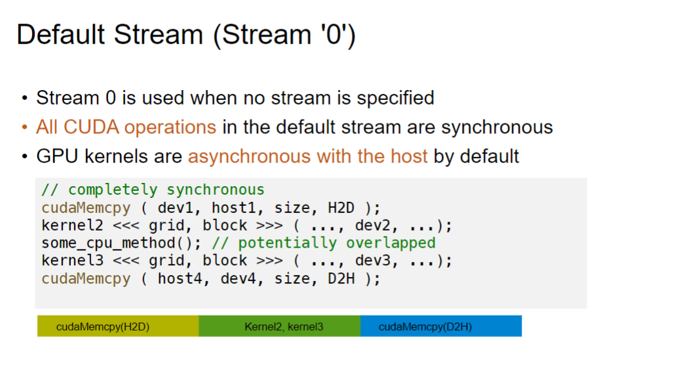

您提供的图片解释了 CUDA 编程中的**默认流（Default Stream）**，即 **Stream '0'** 的行为特性，以及它对同步的影响。

### 1\. 默认流的定义

  * **Stream 0 is used when no stream is specified**
      * 在 CUDA 编程中，如果您在启动 Kernel 函数（如 `kernel<<<...>>>`）或进行数据传输（如 `cudaMemcpy`）时**没有明确指定**一个流（Stream），那么 CUDA 运行时会自动使用**默认流**，即 **Stream 0**。

### 2\. 默认流的关键特性（同步行为）

  * **All CUDA operations in the default stream are synchronous**

      * **这是最关键的特性：** 在默认流（Stream 0）中提交的**所有 CUDA 操作**（包括数据拷贝和 Kernel 启动）与**主机端（Host，即 CPU）是同步的**。
      * **同步（Synchronous）** 意味着 CPU 线程在提交了 CUDA 操作（例如 `cudaMemcpy` 或 `kernel<<<...>>>`）后，必须等待该操作**完全完成**，才能继续执行后面的 CPU 代码。

  * **GPU kernels are asynchronous with the host by default**

      * **这是通用规则：** 通常情况下，如果您使用**非默认流**（Stream 1, 2, ...）或在早期的 CUDA 版本中，Kernel 启动（`kernel<<<...>>>`）相对于主机是**异步的（Asynchronous）**。
      * **异步（Asynchronous）** 意味着 CPU 线程启动 Kernel 后，会**立即**返回，继续执行后续的 CPU 代码，而 GPU 上的 Kernel 在后台并行运行。
      * **但是**，由于默认流的同步特性，默认流中的 Kernel 启动（**在新版本的 CUDA 中，默认流的 Kernel 启动也是同步的**）会隐式地同步，从而等待 Kernel 完成。

### 3\. 代码示例分析

图片中的代码片段演示了在默认流下的同步执行：

```c
// completely synchronous
cudaMemcpy( dev1, host1, size, H2D ); // 1. 主机到设备拷贝 (Host to Device)
kernel2 <<< grid, block >>> ( ..., dev2, ...); // 2. Kernel 启动
some_cpu_method(); // 3. CPU 方法
kernel3 <<< grid, block >>> ( ..., dev3, ...); // 4. Kernel 启动
cudaMemcpy ( host4, dev4, size, D2H ); // 5. 设备到主机拷贝 (Device to Host)
```

**执行流程（完全同步）：**

1.  **`cudaMemcpy (H2D)`**：CPU 阻塞，等待数据从主机完全传输到设备。
2.  **`kernel2`**：CPU 阻塞，等待 `kernel2` 在 GPU 上**完全执行完毕**。
3.  **`some_cpu_method()`**：CPU 执行此方法。
4.  **`kernel3`**：CPU 阻塞，等待 `kernel3` 在 GPU 上**完全执行完毕**。
5.  **`cudaMemcpy (D2H)`**：CPU 阻塞，等待数据从设备完全传输回主机。

### 4\. 时序图解

底部的时间轴图（虽然只有三个大色块）反映了这种同步模式：

| 阶段 | 操作 | 特性 |
| :---: | :---: | :---: |
| **黄色** | `cudaMemcpy(H2D)` | CPU 必须等待其完成。 |
| **绿色/蓝色** | `Kernel2, kernel3` | `Kernel2` 等待 `H2D` 完成。`Kernel3` 等待 `Kernel2` 完成。CPU 必须等待它们都完成。 |
| **深蓝** | `cudaMemcpy(D2H)` | 等待所有 Kernel 完成。CPU 必须等待其完成。 |

**总结：** 默认流中的操作都是**顺序执行**的（GPU 上的操作按提交顺序执行），并且是**主机同步**的（CPU 必须等待 GPU 上的操作完成）。这种模式**阻止了 CPU/GPU 之间或 GPU 操作之间的重叠执行**，因此不利于最大化利用 GPU 的并行性。为了实现真正的并行和重叠执行，必须使用**非默认流（Non-Default Streams）**。


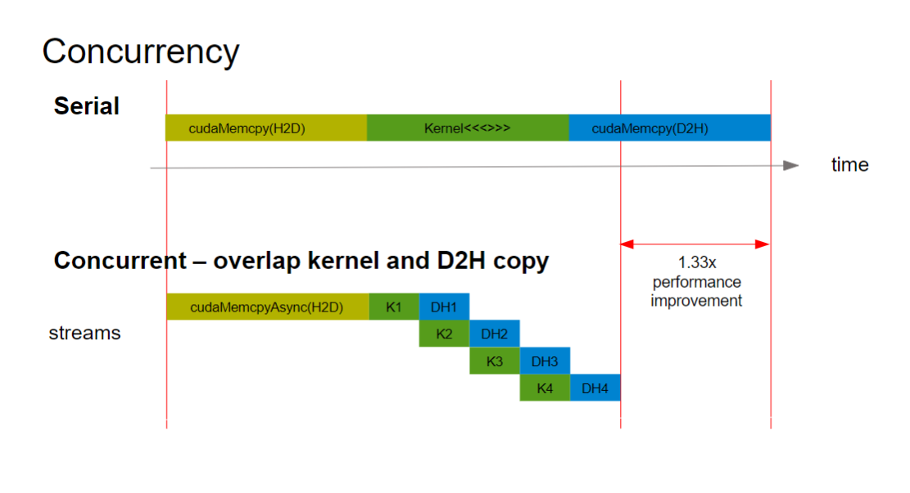
利用流来实现并行：  
您提供的图片展示了在 CUDA 编程中，使用**流（Streams）**实现操作**并行（Concurrency）**，以优化性能的原理。这对比了串行执行和并行重叠执行两种模式。

### 1. 串行执行（Serial）

顶部的时间轴图展示了**单流（默认流 '0'）**或串行执行模式下的任务流程：

* **模式**：所有操作按顺序依次执行，没有任何重叠。
* **流程**：
    1.  **`cudaMemcpy(H2D)`** (黄色)：主机到设备的数据拷贝。
    2.  **`Kernel<<<>>>`** (绿色)：GPU 计算任务。
    3.  **`cudaMemcpy(D2H)`** (深蓝)：设备到主机的数据拷贝。
* **时间**：总执行时间是三部分时间的简单相加。这种模式效率低下，因为 GPU 资源在数据传输期间处于空闲状态，反之亦然。

### 2. 并行执行（Concurrent）——利用流实现重叠

底部的时间轴图展示了使用**多个流（Streams）**实现任务重叠的并行执行模式：

* **核心思想**：将整个任务分解成多个独立的小块（例如 4 块），并使用不同的流来处理这些小块，从而让数据传输和计算可以**同时进行（重叠）**。
* **操作变化**：使用异步的 API 版本，例如 `cudaMemcpyAsync()`，并指定流。
* **流程（任务分解为 4 块，K1 到 K4）**：
    1.  **H2D 拷贝（黄色）**：可能有一个初始的 H2D 拷贝。
    2.  **任务 1 (K1, DH1)**：第一个数据块在 Stream 1 中执行 Kernel (K1)，完成后将结果传回 (DH1)。
    3.  **重叠发生**：
        * 当 **Kernel K2** 在 Stream 2 中执行时，**数据传输 DH1**（K1 的结果）已经在进行中。
        * 当 **Kernel K3** 在 Stream 3 中执行时，**数据传输 DH2**（K2 的结果）和 **Kernel K4** 都在进行中。
* **结果**：通过将计算（K1, K2, K3, K4）与数据回传（DH1, DH2, DH3, DH4）重叠，大大减少了整体的执行时间。

### 3. 性能提升

* **`1.33x performance improvement`**
    * 图片用一个红色的双箭头标记了并行执行所节省的时间，并给出了一个具体的性能提升示例：**1.33 倍**。
    * **原因**：在重叠模式下，GPU 始终处于忙碌状态。例如，它可以在执行当前块的计算（Kernel）的同时，将前一个块的计算结果传回主机（D2H），并为下一个块准备数据（H2D，如果可以重叠）。这最大化了 GPU 的**计算单元**和**内存带宽**的利用率。

### 总结

这张图清晰地说明了在 CUDA 编程中：

1.  **串行（默认流）** 会导致资源空闲。
2.  **利用流** 实现操作的**并发重叠**（尤其是将 Kernel 计算与 D2H 数据回传重叠），是释放 GPU 性能潜力的关键方法。

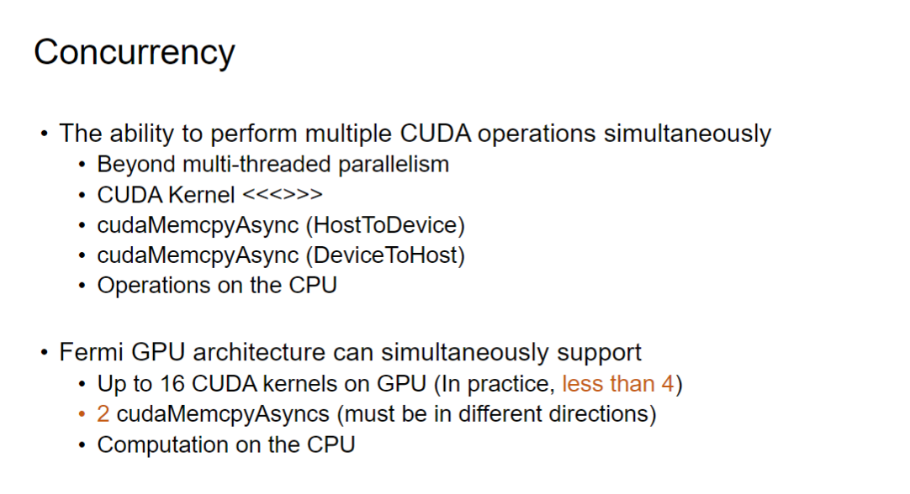
您提供的图片进一步阐述了 CUDA 编程中的**并行（Concurrency）**概念，并指出了 NVIDIA **Fermi 架构**（一种较早的 GPU 架构）所支持的具体并行能力。

### 1. 并行（Concurrency）的定义与范围

* **Concurrency: The ability to perform multiple CUDA operations simultaneously.**
    * **定义**：并行是指能够同时执行多个 CUDA 操作的能力。
* **Beyond multi-threaded parallelism**
    * 这里的“并行”不仅仅指 Kernel 内部的线程级并行，而是指**不同类型的操作**（如计算、数据传输、主机操作）之间的并行。
* **可同时进行的操作示例**：
    * **CUDA Kernel `<<<>>>`**：GPU 上的计算任务。
    * **`cudaMemcpyAsync (HostToDevice)`**：主机到设备的数据传输。
    * **`cudaMemcpyAsync (DeviceToHost)`**：设备到主机的数据传输。
    * **Operations on the CPU**：主机（CPU）上的计算任务。

### 2. Fermi GPU 架构的并行支持能力

图片明确列出了 Fermi 架构（CUDA 2.x/3.x 时代的主流架构）所支持的硬件并行限制。这些限制决定了使用流（Streams）时能达到的最大重叠程度：

* **Up to 16 CUDA kernels on GPU (In practice, less than 4)**
    * **理论最大值**：Fermi 架构在硬件上理论上可以同时容纳多达 16 个活动的 CUDA Kernel。
    * **实际限制**：但在实际应用中，由于资源限制（如共享内存、寄存器等），能够高效地同时运行的 Kernel 数量通常远低于这个理论值，一般认为**小于 4 个**是比较实际的。这意味着将任务分解成 4 个流通常就能达到计算资源的饱和。

* **2 `cudaMemcpyAsync`s (must be in different directions)**
    * **限制**：GPU 只能同时执行 **2 个异步数据传输**。
    * **方向要求**：这两个传输必须是**不同方向**的：
        1.  一个是从主机到设备（H2D）。
        2.  另一个是从设备到主机（D2H）。
    * **意义**：这允许计算（Kernel）与 H2D 和 D2H 传输同时发生，从而实现三者重叠（Triad Overlap），但如果尝试同时进行 3 个 H2D 或 3 个 D2H 传输，则硬件不支持。

* **Computation on the CPU**
    * **CPU/GPU并行**：CPU 上的计算任务可以与 GPU 上的所有 Kernel 和数据传输同时进行。这是实现系统级并行加速的关键。

### 总结

这张图是 CUDA 性能优化的指南：要最大化 Fermi 架构的性能，程序应该将工作分解为 3 或 4 个流，并尝试实现 **Kernel 计算、H2D 拷贝、D2H 拷贝和 CPU 计算**之间的最大重叠。更新的 GPU 架构（如 Kepler, Pascal, Volta, Ampere 等）已经放宽了这些限制，提供了更高的并行度和更多的并发传输能力。

